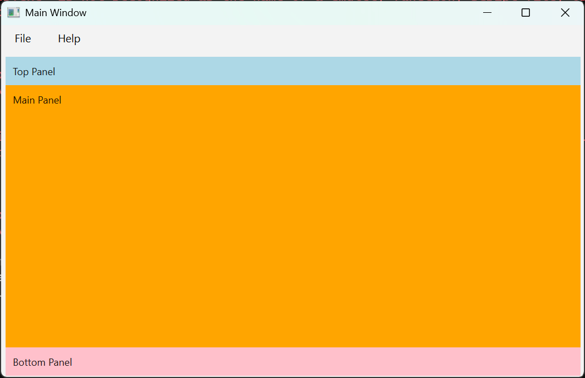
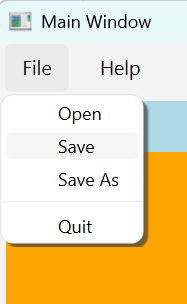

# Anatomy of basic application

## Introduction

Here we are going to create GUI application that does not do anything but simply showcases components of basic layout,
common menus like _File_ and _Help_ and ability to save and restore position and dimensions of the app window on
the screen.

If you have already run following line in your terminal (PowerShell on Windows)

```text
$ pipx install --python 3.13 git+https://github.com/priimak/pyside6_by_example.git
```

you can run this app by running

```text
$ pyside6_example_1
```

In the first iteration this application will consist entirely of just one
file [main.py](https://github.com/priimak/pyside6_by_example/blob/master/src/pyside6_by_example/examples/basic_1/main.py).
In the subsequent example we will split this app into many files which is more suitable for more complicated
applications. It should be noted, however, that there are plenty of use cases where one file GUI app is all that
is needed. Hence, you can use this code as a template for the most simple apps. If, however, your is complicated enough
or may become complicated later, it is better to use more structured code.

## GUI Overview

For many GUI apps basic layout has the following form:



with _File_ menu



So lets construct an application that when started shows this exact layout. To be able to see these three 
panels (top, middle/main and bottom) we give them three different color backgrounds.

## MainWindow

To that end we
create [MainWindow](https://github.com/priimak/pyside6_by_example/blob/aac33ca9786008adb020a0b0c2005413cfc0f96c/src/pyside6_by_example/examples/basic_1/main.py#L12)
class
which extends [`QMainWindow`](https://doc.qt.io/qtforpython-6/PySide6/QtWidgets/QMainWindow.html)

```python
from PySide6.QtWidgets import QMainWindow
from pyside6_by_example.tools.app_persist import AppPersistence


class MainWindow(QMainWindow):
    def __init__(
            self,
            screen_dim: tuple[int, int],
            app_persistence: AppPersistence
    ):
        super().__init__()
        self.app_state = app_persistence.state
        self.setWindowTitle("Main Window")
        self.set_geometry(screen_dim[0], screen_dim[1])
        self.define_menus()
        self.define_panels()

    def set_geometry(self, screen_width: int, screen_height: int) -> None: ...

    def define_menus(self) -> None: ...

    def define_panels(self) -> None: ...
```

We pass screen dimensions (`screen_dim: tuple[int, int]`) in the form of screen width and height which is then
used in `self.set_geometry(...)` function to open this window in the center of screen occupying some fraction
of the screen.

Class [
`AppPersistance`](https://github.com/priimak/pyside6_by_example/blob/master/src/pyside6_by_example/tools/app_persist.py)
holds functions that deal with
application [config](https://github.com/priimak/pyside6_by_example/blob/master/src/pyside6_by_example/tools/app_config.py)
and [state](https://github.com/priimak/pyside6_by_example/blob/master/src/pyside6_by_example/tools/app_state.py).
Configuration and state are
very similar but differ in intent. Configuration is something that does not change very often and is controlled
by the user, typically through the _Settings_ window. State on the other hand is volatile that changes implicitly
while application is running. In this example we will use to store position of main window on the screen and
its dimensions. Both, the state and the configuration, need to persist between application restarts, hence class is
called `AppPersistance`. Specifics of how and where data is persisted on the disk is irrelevant here and will be
addressed elsewhere.

Now lets go through defining functions listed in the `MainWindow` constructor.

## set_geometry(...)

When app closes we
save [geometry](https://doc.qt.io/qtforpython-6/overviews/application-windows.html#overviews-window-geometry)
(window position on the screen and its dimensions) of the main window in `self.app_state`.

The first time our application is run its geometry has not been saved yet and `AppState::get_geometry("main")` return
`None`.
In that case we manually set geometry of the main window to occupy 60% of the screen in the middle of the screen.

On subsequent runs geometry of the main window should already be saved and thus `loaded_geometry` will not be `None`. In
this case we restore main window geometry by calling [
`QMainWindow::restoreGeometry(...)`](https://doc.qt.io/qtforpython-6/PySide6/QtWidgets/QWidget.html#PySide6.QtWidgets.QWidget.restoreGeometry)

Field `self.app_state: AppState`

``` python
def set_geometry(self, screen_width: int, screen_height: int):
    # Try loading geometry from saved app state
    loaded_geometry: QByteArray | None = self.app_state.get_geometry("main")
    if loaded_geometry is None:
        # Init main window size to be 60% of the screen size
        win_size_fraction = 0.6
        self.setGeometry(
            int(screen_width * (1 - win_size_fraction) / 2),
            int(screen_height * (1 - win_size_fraction) / 2),
            int(screen_width * win_size_fraction),
            int(screen_height * win_size_fraction)
        )
    else:
        self.restoreGeometry(loaded_geometry)
```

To ensure that geometry is saved we override function [
`QWidget::closeEvent(...)`](https://doc.qt.io/qtforpython-6/PySide6/QtWidgets/QWidget.html#PySide6.QtWidgets.QWidget.closeEvent)
called when window is closing.

```python
@override
def closeEvent(self, event: QCloseEvent):
    self.app_state.save_geometry("main", self.saveGeometry())
    event.accept()
```

## define_menus(...)

Function `define_menus()` creates instance of [
`QMenuBar`](https://doc.qt.io/qtforpython-6/PySide6/QtWidgets/QMenuBar.html),
adds two menus to it and sets it on the instance of `QMainWindow` by calling [
`QMainWindow::setMenuBar`](https://doc.qt.io/qtforpython-6/PySide6/QtWidgets/QMainWindow.html#PySide6.QtWidgets.QMainWindow.setMenuBar).

```python
def define_menus(self) -> None:
    menu_bar = QMenuBar()
    menu_bar.addMenu(self.get_file_menu(menu_bar))
    menu_bar.addMenu(self.get_help_menu(menu_bar))
    self.setMenuBar(menu_bar)
```

Menus `File` and `Help` are defined in their own functions. Note, use of `&` (ampersand) in menu and action labels.
These define keyboard shortcuts. To exist application user can press `Ctrl+F` followed by `Ctrl+Q`.

```python
def get_file_menu(self, menu_bar: QMenuBar) -> QMenu:
    file_menu = QMenu("&File", menu_bar)
    file_menu.addAction("&Open", lambda: None)
    file_menu.addAction("&Save", lambda: None)
    file_menu.addAction("Save &As", lambda: None)
    file_menu.addSeparator()
    file_menu.addAction("&Quit", self.close)
    return file_menu
```

```python
def get_help_menu(self, menu_bar: QMenuBar) -> QMenu:
    help_menu = QMenu("&Help", menu_bar)
    help_menu.addAction(
        "&About",
        lambda: QMessageBox.about(self, "About", "Basic example")
    )
    return help_menu
```

## define_panels(...)

Most of the non-trivial GUI elements represented by classes that
extend [QWidget](https://doc.qt.io/qtforpython-6/PySide6/QtWidgets/QWidget.html).
Class `QWidget` itself can serve as a container for other widgets. That commonly accomplished indirectly, by setting a
particular [QLayout](https://doc.qt.io/qtforpython-6/PySide6/QtWidgets/QLayout.html) and then adding other widgets to
it.

```python
def define_panels(self) -> None:
    root_panel = QWidget()
    layout = QVBoxLayout()
    root_panel.setLayout(layout)
    layout.setContentsMargins(QMargins(5, 5, 5, 1)) # spacing around root_panel
    layout.setSpacing(0) # spacing between widgets added to the layout

    layout.addWidget(self.get_top_panel())
    layout.addWidget(self.get_main_panel(), stretch = 1)
    layout.addWidget(self.get_bottom_panel())

    self.setCentralWidget(root_panel)
```
When widgets are added to the [`QVBoxLayout`](https://doc.qt.io/qtforpython-6/PySide6/QtWidgets/QVBoxLayout.html) each 
subsequent one is added below the previous one. They will naturally be stretched to occupy the same fraction of 
available vertical space. This is not what we actually want. When we resize the window we want main panel to grow while
top and the bottom panels to stay at their minium vertical size. But adding `stretch = 1` when we add MainPanel widget
to the layout we ensure desired behaviour.

Functions below create three different widgets/panels. These functions we almost identical, main difference being text 
the label and background color in each.

```python
def get_top_panel(self) -> QWidget:
    top_panel = QWidget()
    top_panel.setAutoFillBackground(True)

    palette = QPalette()
    palette.setColor(QPalette.ColorRole.Window, "lightblue")
    top_panel.setPalette(palette)

    layout = QHBoxLayout()
    top_panel.setLayout(layout)
    layout.addWidget(QLabel("Top Panel"))

    return top_panel
```

```python
def get_main_panel(self) -> QWidget:
    panel = QWidget()
    panel.setAutoFillBackground(True)

    palette = QPalette()
    palette.setColor(QPalette.ColorRole.Window, "orange")
    panel.setPalette(palette)

    layout = QVBoxLayout()
    panel.setLayout(layout)
    layout.addWidget(
        QLabel("Main Panel"),
        alignment = Qt.AlignmentFlag.AlignTop | Qt.AlignmentFlag.AlignLeft
    )

    return panel
```

```python
def get_bottom_panel(self) -> QWidget:
    panel = QWidget()
    panel.setAutoFillBackground(True)

    palette = QPalette()
    palette.setColor(QPalette.ColorRole.Window, "pink")
    panel.setPalette(palette)

    layout = QHBoxLayout()
    layout.addWidget(QLabel("Bottom Panel"))
    panel.setLayout(layout)

    return panel
```

## main.py

At the end we pack entire application code into one file `main.py` and add function `main()` which 
starts [`QApplication`](https://doc.qt.io/qtforpython-6/PySide6/QtWidgets/QApplication.html). Think of `QApplication` 
as a runtime that manages window and widget creation and destruction.

```python
import sys

from PySide6.QtWidgets import QApplication

from pyside6_by_example.examples.basic_1.main import MainWindow
from pyside6_by_example.tools.app_persist import AppPersistence


class AppPersistence:
    ...


def main():
    app = QApplication(sys.argv)

    # Will init main window size to be some fraction of the screen size
    # unless defined elsewhere
    screen_width, screen_height = app.primaryScreen().size().toTuple()

    win = MainWindow(
        screen_dim = (screen_width, screen_height),
        app_persistence = AppPersistence("basic_1", {})
    )
    win.show()

    sys.exit(app.exec())


if __name__ == '__main__':
    main()
```

## Links

* [QApplication](https://doc.qt.io/qtforpython-6/PySide6/QtWidgets/QApplication.html)
* [QMainWindow](https://doc.qt.io/qtforpython-6/PySide6/QtWidgets/QMainWindow.html)
* [QMessageBox](https://doc.qt.io/qtforpython-6/PySide6/QtWidgets/QMessageBox.html)
* [QMenuBar](https://doc.qt.io/qtforpython-6/PySide6/QtWidgets/QMenuBar.html)
* [QMenu](https://doc.qt.io/qtforpython-6/PySide6/QtWidgets/QMenu.html)
* [QVBoxLayout](https://doc.qt.io/qtforpython-6/PySide6/QtWidgets/QVBoxLayout.html)
* [QHBoxLayout](https://doc.qt.io/qtforpython-6/PySide6/QtWidgets/QHBoxLayout.html)
* [QWidget](https://doc.qt.io/qtforpython-6/PySide6/QtWidgets/QWidget.html)
* [QLabel](https://doc.qt.io/qtforpython-6/PySide6/QtWidgets/QLabel.html)
